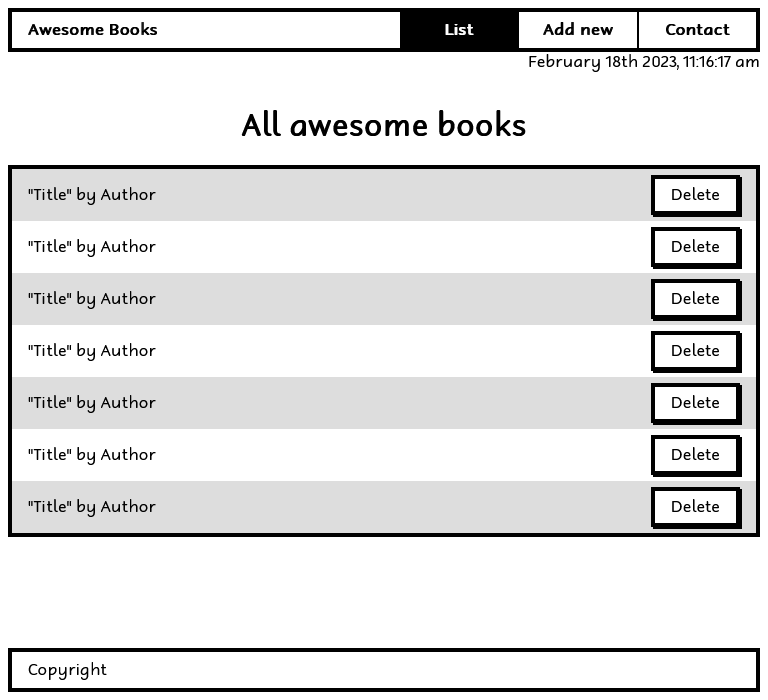
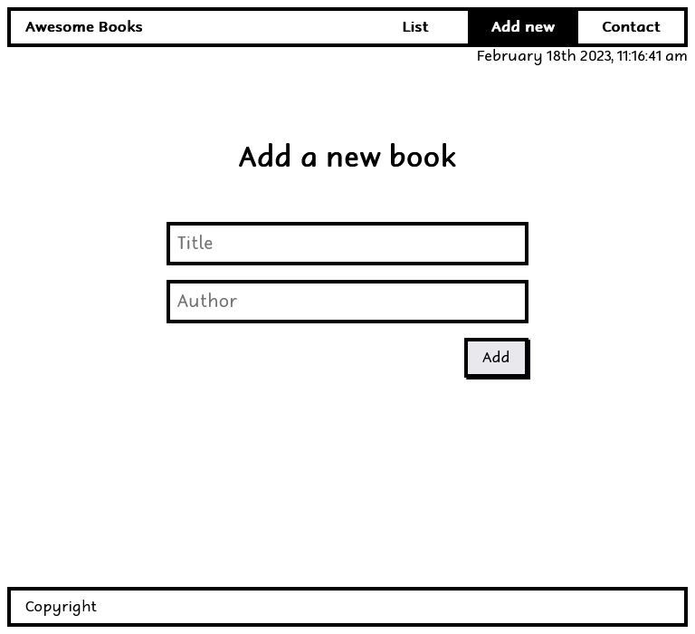
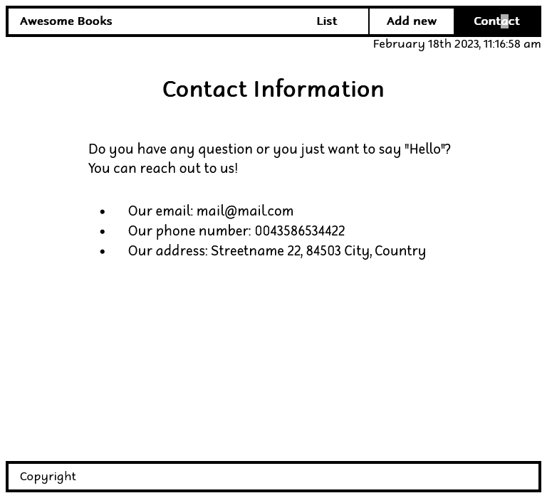

# Awesome books: plain JavaScript with objects

## 📗 Table of Contents

- [📖 Overview](#about-project)
  - [Project Objectives](#project-objectives)
  - [🛠 Built With](#built-with)
    - [Tech Stack](#tech-stack)
    - [Key Features](#key-features)
  - [🚀 Live Demo](#live-demo)
    - [Screenshots](#screenshots)
- [💻 Getting Started](#getting-started)
  - [Setup](#setup)
  - [Prerequisites](#prerequisites)
  - [Install](#install)
  - [Run tests](#run-tests)
  - [Deployment](#deployment)
- [👥 Authors](#authors)
- [🔭 Future Features](#future-features)
- [🤝 Contributing](#contributing)
- [⭐️ Show your support](#support)
- [🙏 Acknowledgements](#acknowledgements)
- [📝 License](#license)

## 📖 Overview 

This project is a contiuation of <a href = "https://yosaddis.github.io/Awesome-books"> Awsome Books </a>. In this repo the project adopts Java Script ES6 standars. And uses modularises the functionalities of the projects.

### Project Objectives 

- [x] Clone the functionalities of the previous project
- [x] Create a modular structure. 
- [x] Create Books module and import it to index.js
- [x] Create datetime module and import it to index.js
- [x] Install luxon to the project and use it in datetime module.
- [x] Create .eslintignore to ignore luxon files during linter check.

## 🛠 Built With 

### Tech Stack 

- [HTML](https://developer.mozilla.org/en-US/docs/Web/HTML)
- [JavaScript](https://developer.mozilla.org/en-US/docs/Web/JavaScript)
- [CSS](https://developer.mozilla.org/en-US/docs/Web/CSS)

### Key Features 

- [x] Preserving data with localStorage
- [x] Use ES6 Standard

## 🚀 Live Demo 

> [Live Demo Link](https://yosaddis.github.io/Awesome-Books-ES6/)

### Screenshots 

<h3 align="center">Screenhot</h3>

  

  

  

## 💻 Getting Started 

- [Optional] Install git bash to your machine to enable you to clone this repo.
- install Visual Studio to be able to host a local live version.
- Install a browser to view the local live version.

To get a local copy up and running follow these simple example steps.

### Setup 

- Open your GitHub account the repository's [link](https://github.com/yosaddis/Awesome-books-ES6)

### Prerequisites 

- Internet connection
- A github account

### Install 

- copy the repo's link and clone it by writing `git clone https://github.com/yosaddis/Awesome-books-ES6.git` on your git bash terminal.
- `npm install` to install the dependencies

### Run tests 

- You can check for errors by running linter tests found in the github flows.

### Deployment 

- Click on 'go live' on your visual studio to view the project live on your local machine.

## Authors 

👤 Yoseph Addisu

- [GitHub](https://github.com/yosaddis)
- [LinkedIn](https://www.linkedin.com/in/yoseph-addisu-79a58b60)

## 🤝 Contributing 

Contributions, issues, and feature requests are welcome!

Feel free to check the [issues page](../../issues/).

## ⭐️ Show your suppor 

Give a ⭐️ if you like this project!

## 📝 License 

This project is [MIT](./LICENSE) licensed.
